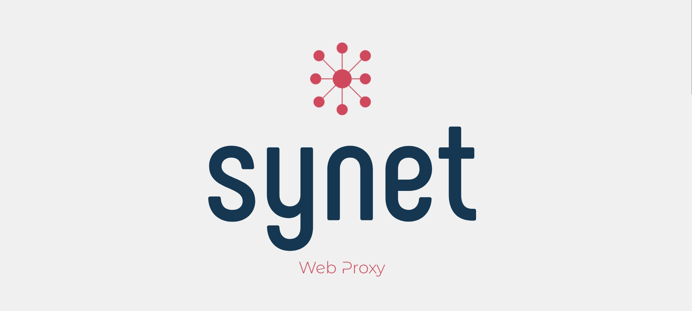

<!--
*** Thanks for checking out the Best-README-Template. If you have a suggestion
*** that would make this better, please fork the repo and create a pull request
*** or simply open an issue with the tag "enhancement".
*** Thanks again! Now go create something AMAZING! :D
-->

<!-- assignment SHIELDS -->
<!--
*** I'm using markdown "reference style" links for readability.
*** Reference links are enclosed in brackets [ ] instead of parentheses ( ).
*** See the bottom of this document for the declaration of the reference variables
*** for contributors-url, forks-url, etc. This is an optional, concise syntax you may use.
*** https://www.markdownguide.org/basic-syntax/#reference-style-links
-->
[![Contributors][contributors-shield]][contributors-url]
[![Forks][forks-shield]][forks-url]
[![Stargazers][stars-shield]][stars-url]
[![Issues][issues-shield]][issues-url]
[![MIT License][license-shield]][license-url]
[![LinkedIn][linkedin-shield]][linkedin-url]
[](https://depshield.github.io)

<!-- assignment LOGO -->
<br />
<p align="center">
  <a href="https://github.com/Rubix982/Synet">
    
  </a>

  <h2 align="center">ASP.NET | ReactJS</h2>  
  <h3 align="center">Web Proxy</h3>

  <p align="center">
    A web proxy, implemented in ASP.NET
    <br />
    <br />
    <a href="https://github.com/Rubix982/Synet/issues">Report Bug</a>
    ·
    <a href="https://github.com/Rubix982/Synet/issues">Request Feature</a>
  </p>
</p>

<!-- TABLE OF CONTENTS -->
<details open="open">
  <summary>Table of Contents</summary>
  <ol>
    <li>
      <a href="#about-the-assignment">About The assignment</a>
      <ul>
        <li><a href="#built-with">Built With</a></li>
      </ul>
    </li>
    <li>
      <a href="#getting-started">Getting Started</a>
      <ul>
        <li><a href="#prerequisites">Prerequisites</a></li>
        <li><a href="#installation">Installation</a></li>
      </ul>
    </li>
    <li><a href="#usage">Usage</a></li>
    <li><a href="#roadmap">Roadmap</a></li>
    <li><a href="#contributing">Contributing</a></li>
    <li><a href="#license">License</a></li>
    <li><a href="#contact">Contact</a></li>
    <li><a href="#acknowledgements">Acknowledgements</a></li>
  </ol>
</details>


<!-- ABOUT THE assignment -->
## About The assignment

ABANDONED REPO

### Overiew

Repository for CN CS307's 1st assignment for web proxies. Please see the actual assignment sas attached [here](https://github.com/Rubix982/Synet/blob/main/assets/doc/A01-CN-SP21.pdf).

The notion page for this repository can be found as the following,

<div>
<iframe
  src="https://www.notion.so/CN-Assignment-1-88106ce5c57d428ba42a8869e622d38c"
  style="width:100%; height:300px;"
></iframe>
</div>

### Built With

This section should lists the technologies used,

- *Docker | Docker Compose*, to isolate the application
- *Makefile and bash scripts*, to help and develop the project quicker
- *ReactJS*, a CRA in the client
- *Python*, to write some automation scripts
- *ASP NET Core 5.0*, to write the server side for the actual proxy

### Screenshots

[![Synet - Main Dashboard][product-screenshot-1]](https://synet-rubix982.vercel.app/app/dashboard)
[![Synet - Ban Page][product-screenshot-2]](https://synet-rubix982.vercel.app/app/Ban)
[![Synet - Ban Page][product-screenshot-3]](https://synet-rubix982.vercel.app/login)
[![Synet - Ban Page][product-screenshot-4]](https://synet-rubix982.vercel.app/account)

### Requirements Fulfilled

The list of requirements that have been fulfilled uptil now with respect to the uploaded assignment document have been listed here,

- [X] Connect the proxy with the browser - just going to stick with Python automation ( *I guess it's valid!* )
- [X] Admin Console
- [X] Filtering Rules
- [X] HTTP Connection
- [X] Concurrency Management
- [X] HTTPS Connection
- [X] Caching
  - [X] LRU Algorithm
  - [X] LFU Algorithm
  - [X] Redis Integration
  - [ ] Redis caching, estimate 2-3 hours
    - [ ] How to measure performance
    - [ ] How to find out if the caching is helpful

To see the original assignment, please take a look at [About Section](#about-the-assignment).

<!-- GETTING STARTED -->
## Getting Started

This is an example of how you may give instructions on setting up your assignment locally.
To get a local copy up and running follow these simple example steps.

### Prerequisites

This project was developed on Linux to simplify the workflow. 

Keeping Linux in mind, you just need,

- Git
- Docker

### Installation

Find git from `https://www.git-scm.org`, and Docker from their main page.
After that, simply run the following commands to build and start the project,
```sh
git clone https://www.github.com/Rubix982/Synet
cd Synet
make build-dev # Assuming you're working on Linux
```

<!-- USAGE EXAMPLES -->
## Usage

TODO!!!!!!!

Use this space to show useful examples of how a assignment can be used. Additional screenshots, code examples and demos work well in this space. You may also link to more resources.

_For more examples, please refer to the [Documentation](https://github.com/Rubix982/Synet)_

<!-- ROADMAP -->
## Roadmap

See the [open issues](https://github.com/Rubix982/Synet/issues) for a list of proposed features (and known issues).

<!-- CONTRIBUTING -->
## Contributing

Contributions are what make the open source community such an amazing place to be learn, inspire, and create. Any contributions you make are **greatly appreciated**.

1. Fork the assignment
2. Create your Feature Branch (`git checkout -b feature/AmazingFeature`)
3. Commit your Changes (`git commit -m 'Add some AmazingFeature'`)
4. Push to the Branch (`git push origin feature/AmazingFeature`)
5. Open a Pull Request

<!-- LICENSE -->
## License

Distributed under the  Apache-2.0 License License. See [LICENSE](https://github.com/Rubix982/Synet/blob/main/LICENSE) for more information.

<!-- CONTACT -->
## Contact

- Your Name: *Saif Ul Islam*
- Github: *[@Rubix982](https://github.com/Rubix982/)*
- Email: *saifulislam84210@gmail.com*
- LinkedIn: *[Saif Ul Islam](https://www.linkedin.com/in/saif-ul-islam-93786b187/)*

<!-- ACKNOWLEDGEMENTS -->
## Acknowledgements

- [GitHub Emoji Cheat Sheet](https://www.webpagefx.com/tools/emoji-cheat-sheet)
- [Img Shields](https://shields.io)
- [Choose an Open Source License](https://choosealicense.com)
- [GitHub Pages](https://pages.github.com)
- [Animate.css](https://daneden.github.io/animate.css)
- [Loaders.css](https://connoratherton.com/loaders)
- [Slick Carousel](https://kenwheeler.github.io/slick)
- [Smooth Scroll](https://github.com/cferdinandi/smooth-scroll)
- [Sticky Kit](http://leafo.net/sticky-kit)
- [JVectorMap](http://jvectormap.com)
- [Font Awesome](https://fontawesome.com)


<!-- MARKDOWN LINKS & IMAGES -->
<!-- https://www.markdownguide.org/basic-syntax/#reference-style-links -->
[contributors-shield]: https://img.shields.io/github/contributors/Rubix982/Synet.svg?style=for-the-badge
[contributors-url]: https://github.com/Rubix982/Synet/graphs/contributors
[forks-shield]: https://img.shields.io/github/forks/Rubix982/Synet.svg?style=for-the-badge
[forks-url]: https://github.com/Rubix982/Synet/network/members
[stars-shield]: https://img.shields.io/github/stars/Rubix982/Synet.svg?style=for-the-badge
[stars-url]: https://github.com/Rubix982/Synet/stargazers
[issues-shield]: https://img.shields.io/github/issues/Rubix982/Synet.svg?style=for-the-badge
[issues-url]: https://github.com/Rubix982/Synet/issues
[license-shield]: https://img.shields.io/github/license/Rubix982/Synet.svg?style=for-the-badge
[license-url]: https://github.com/Rubix982/Synet/blob/master/LICENSE.txt
[linkedin-shield]: https://img.shields.io/badge/-LinkedIn-black.svg?style=for-the-badge&logo=linkedin&colorB=555
[linkedin-url]: https://www.linkedin.com/in/saif-ul-islam-93786b187/
<!-- [product-screenshot]: assets/img/screenshot.png -->
[product-screenshot-1]: assets/img/Synet-1.png
[product-screenshot-2]: assets/img/Synet-2.png
[product-screenshot-3]: assets/img/Synet-3.png
[product-screenshot-4]: assets/img/Synet-4.png
